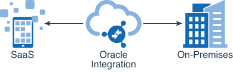

# Application Integration Concepts

The following topics describe each of the components required to create an end-to-end integration. Each integration includes connections and mappings. You can also include lookups, which are reusable mappings for the different codes and terms used in your applications to describe the same item. You can also group integrations into packages.

## About Connections

Connections define information about the instances of each configuration you are integrating. Oracle Integration includes a set of predefined adapters, which are the types of applications on which you can base your connections, such as Oracle Engagement Cloud Adapter, Oracle Eloqua Cloud, Oracle Service Cloud (RightNow) Adapter, and others. A connection is based on an adapter. For example, to create a connection to a specific Oracle Service Cloud application instance, you must select the Oracle Service Cloud (RightNow) Adapter and then specify the WSDL URL, security policy, and security credentials to connect to it.

## About Integrations

Integrations are the main ingredient of Oracle Integration. An integration includes at the least a trigger (source) connection (for requests sent to Oracle Integration) and invoke (target) connection (for requests sent from Oracle Integration to the target) and the field mapping between those two connections.

When you create your integrations, you build on the connections you already created by defining how to process the data for the trigger (source) and invoke (target) connections. This can include defining the type of operations to perform on the data, the business objects and fields against which to perform those operations, required schemas, and so on. To make this easier, the most complex configuration tasks are handled by Oracle Integration. Once your trigger (source) and invoke (target) connections are configured, the mappers between the two are enabled so you can define how the information is transferred between the trigger (source) and invoke (target) data structures for both the request and response messages.

## About Mappings

One of the key tasks to any integration is defining how data is transferred, or mapped, between two applications.

In most cases, the messages you want to transfer between the applications in an integration have different data structures. A visual mapper enables you to map element nodes between applications by dragging source element nodes onto target element nodes. When you open the mapper for a request or response message in an integration, the data structures are automatically populated with the information pulled from the source and target connections. You can expand and load data structure levels on demand to display additional levels. There is no limit on the levels of display.

The maps you create are called transformation maps, and use the eXtensible Stylesheet Language (XSL) to describe the data mappings, which let you perform complex data manipulation and transformation. A standard set of XSLT constructs are provided (for example, xsl:if, xsl:for-each, and others). A specialized function is also provided for you to reference lookups directly from the mapper.

The mapper supports both qualified and unqualified schemas (that is, schemas without elementFormDefault=”qualified”). Elements and attributes with and without namespace prefixes are also supported.

Substitution groups in schemas are supported. You can see all the substitutable elements in a base element in the mapper, and select the one to use.

Extended data types are also supported.

Elements and attributes for which mapping is required are identified by a blue asterisk (*) to the left of their names. To display only required fields, click the Filter icon in the mapper toolbar, select Required Fields, and click Apply.

You can also place your cursor over elements and attributes to display specific schema details such as the data type, if mapping is required, and so on.

## About Lookups

Use lookups in your integrations to create reusable tables that map the different terms used to describe the same item across your applications.

A lookup associates values used by one application for a specific item to the values used by other applications for the same item. For example, one application uses a specific set of codes to describe countries, while another application uses a different set of codes to describe the same countries. Lookups can be used for items such as mapping gender codes, nationality codes, currency codes—any type of information that your applications must share with each other but that they represent differently. You may have several lookups for one integration, depending on the number of fields that require mapping. Lookups are also reusable, and can be used by multiple integrations. Lookups are based on a static definition, meaning you create and populate them during design time, and are not changed by runtime activities. These tables are used for looking up values only.

## About Packages

You can group one or more integrations into a single structure called a package. Packages enable you to easily import and export a group of integrations to and from Oracle Integration. You can import packages from the Oracle Marketplace. These packages consist of a series of prebuilt integrations provided by Oracle. You can also import and export packages that consist of integrations that you or other users created. Packages are optional, meaning that integrations do not need to be part of packages. However, for a package to exist, it must include at least one integration. Packages cannot be locked to exclude other users of your Oracle Integration instance.

Packages are displayed on the Packages page in Oracle Integration. From this page, you can view, delete, import, and export packages. You create packages when you create an integration in the Create Integration dialog. You can also update an integration’s package in the Update Integration dialog.

## Libraries

## About Connectivity Agent

Using the connectivity agent, you can create hybrid integrations and exchange messages between applications in private or on-premises networks and Oracle Integration. Message payloads of up to 10 MB are supported through the use of compression and files or attachments up to 1 GB can be transferred back and forth between Oracle Integration and on-premises sFTP servers. Similarly, attachments up to 1 GB can be sent to on-premises SOAP/ REST endpoints using the SOAP or REST adapter. The connectivity agent also provides multithreading support, which allows for multiple executors to perform downstream message processing.

In addition, the connectivity agent framework enables SaaS applications in the cloud to interact through Oracle Integration with on-premises systems.

