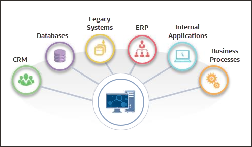
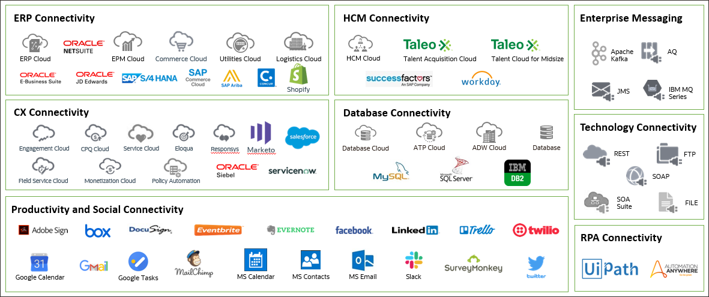
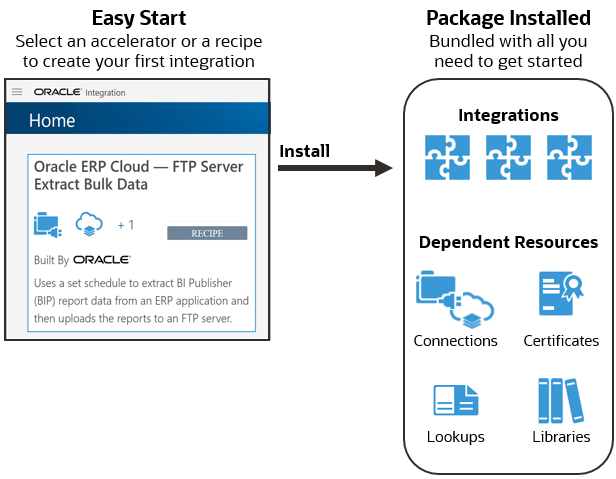
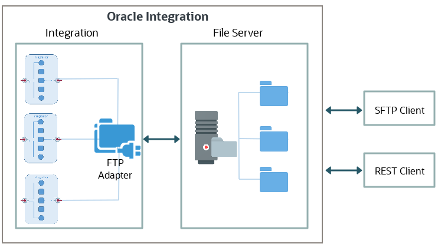
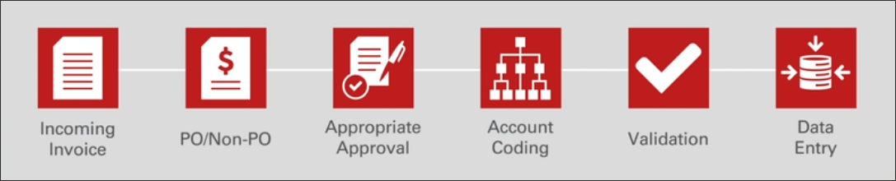
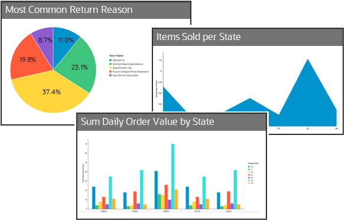
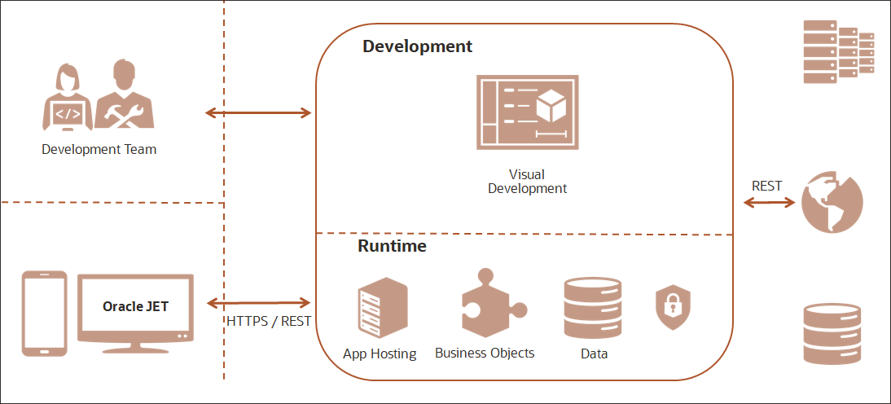
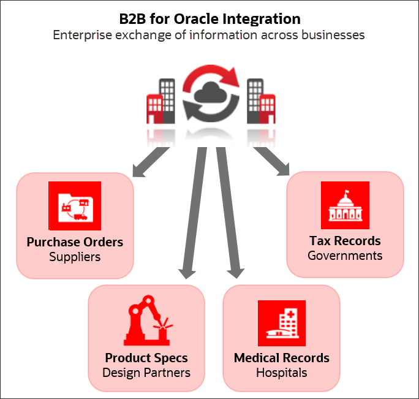

# Welcome to Oracle Integration

Oracle Integration is a secure, unified platform that lets you connect cloud and on-premises
applications, automate business processes, gain insight into your business through business
metrics analysis, and develop web and mobile applications.

Integration is a fundamental part of your digital business development. It involves connecting
on-premises applications and cloud applications and services. Oracle Integration makes it
easy to connect your applications and automate end-to-end processes such as procure to
pay, inquiry to order, and hire to retire.

With Oracle Integration, you can:

* Develop integrations to design, monitor, and manage connections between your applications
* Create process applications to automate and manage your business work flows
* Analyze results to gain insight into your business
* Build custom web and mobile applications

Critical business processes, such as those related to human capital management (HCM), customer experience (CX), and enterprise resource planning (ERP), are frequently slow and inflexible. For example, a multi-step process such as Lead to Opportunity to Quote to Order can involve four or more applications and require human exception management at every step of the process. In this scenario, the lack of integration between departments as well as the delays caused by human-based problem resolution can result in lost revenue, frustrated customers, and high costs.
Oracle Integration changes all that. It empowers you to:

* Establish connectivity between the many applications and people that are part of the entire business process life cycle.
* Assemble existing technologies into new business services to better align with the changing pace of new business demands.
* Deliver new business innovations faster by rapidly connecting diverse applications and key business roles.
* Gain 360-degree views across your entire business. Easily monitor and analyze every application, integration, and workflow spanning the business process life cycle.

## What is Application Integration

Integration solves the application silo problem. It brings together data and workflows between disparate software applications for them to function as one.

Integrations deal with live operational data. Data can be processed either in real-time or in batch, and between two or more applications, events, or application programming interfaces (APIs).

### Deployment Flexibility

With integrations, you can connect to anything without getting bogged down in technical implementation details.

You can bring data and applications together across on-premise and cloud systems: cloud to cloud, cloud to on-premises (ground), and on-premises to on-premises (ground to ground).

### Library of Prebuilt Adapters

When you develop an integration from scratch, your first task is to create a connection for each application that you're going to connect to. The connection defines how you’ll connect to the application. When you create a connection, your first step is to select an adapter.

An adapter provides the means for Oracle Integration to connect to different applications. If you have traveled internationally, then you have probably used a power adapter that allowed your electronic devices to connect safely with a power outlet of a different shape and voltage than what it was originally built for. Well, Oracle Integration adapters do the same thing for software.

Oracle Integration includes dozens of prebuilt adapters that make it easy for your integrations to connect to a range of Oracle and third-party applications, including applications that handle your customer relationships, human resources, supply chain, resource planning, e-commerce, social media, and databases. Also, the FTP, REST, and SOAP Adapters let you use standard file, web, and messaging protocols. And all adapters let you connect to applications that are on premises or in the cloud.

### Integration Accelerators and Recipes

You don't need to start an integration project from scratch. You can install ready-made integration accelerators and recipes from the Home page. Accelerators are run-ready business integrations or technical patterns you can configure and activate. Recipes are starter templates that give you a head start.

When you install an accelerator or a recipe, you get a package of everything you need to easily configure and activate your first integration. The installed package includes one or more integrations, along with all the resources required to run the integration. The dependent resources include the connections as well as any certificates, lookups, and libraries.

### Embedded File Server

Use File Server to store files or transfer real-time data among applications securely. File Server provides an embedded Secure File Transfer Protocol (SFTP) server within Oracle Integration, so you can focus on building integrations without needing to host and maintain a separate SFTP server.

With File Server, you can:

* Design integrations that process your files that reside in the embedded file server.
* Eliminate the cost and operational expenses associated with hosting and maintaining an SFTP server by moving your SFTP server to the cloud. If you have an on-premises SFTP server, then you can move your SFTP files into File Server in Oracle Integration and use the SFTP adapter to connect.
* Give your vendors or partners access to Oracle Integration to upload and download files with their SFTP client software. A common protocol for communication with partners is SFTP. File Server enables partners to send information such as purchase orders, invoices, shipping information, and so on through SFTP.

## What is Process Automation

Automate and optimize any process in your organization. For example, you can automate core business processes such as loan origination if you're a bank, shipping and handling if you're a delivery service, or opportunity to order if you're in retail.

Let's look at an example that automates the process used by the Accounts Payable department to handle incoming invoices. The goals are to eliminate lost invoices and reduce the chance for human errors.

Before Automation

Accounts Payable has to deal with a large volume of paper invoices, which can be confusing and time consuming.

When an invoice is received, the accounts payable clerk has to figure out which action to take depending on the type of invoice (purchase order or not).

The accounts payable clerk then has to send emails to the appropriate colleagues for approvals, handle account coding, validate that all required information has been completed, and at the end, manually enter the data into Oracle E-Business Suite.

After Automation

With Oracle Integration, you can streamline and automate the accounts payable process, eliminating lost invoices, reducing the time to process an invoice, and reducing the chance for human error. Through Integration Insight in Oracle Integration, management also gains visibility into the state of Accounts Payable.

Here's the streamlined process in Oracle Integration:

* Scan the invoices or capture PDFs from emails to extract data using Optical Character Recognition (OCR) with Oracle WebCenter Forms Recognition. The extracted data is stored in Oracle Content and Experience along with the original PDF invoices.
* From Oracle Content and Experience, the accounts payable clerk triggers the invoice approval workflow in Oracle Integration.
* The defined approval process validates the invoice, segregates on invoice type (PO or Non-PO), and processes the invoice according to its type. A purchase order invoice is pre-approved whereas a non-purchase order invoice requires approvals.

The workflow in Process in Oracle Integration has a main process and two subprocesses. One subprocess handles an invoice that's a purchase order; the other handles an invoice that's not a purchase order. Also, notice that there are defined milestones in the processes. These milestones are for analysis with Integration Insight.

## What is Insight

Integration Insight provides real-time business visibility and analytics by allowing business milestones and metrics to be defined, aggregated, and visualized.

By defining an Integration Insight model, you can map milestones to key points in a business process implementation in integration flows or process applications (or both) in Oracle Integration, and extract metrics to allow business executives to view and analyze business processes in real time using dashboards.

With real-time data throughout the business process lifecycle, you get a view of the business that allows you to react quickly to an issue. You have real-time visibility into digital processes for business owners to innovate smarter, and to highlight stalled transactions and errors.

## What is Visual Builder

With Visual Builder, you can extend your applications to meet your unique needs and build great web and mobile applications yourself. There's no coding, no setup, and no IT resources required.

Visual Builder provides all the necessary tools for you to build, publish, and host modern web and mobile applications:

Configure and customize Oracle Cloud applications using the same development environment that Oracle Cloud applications are built on.

Use cloud-based visual tools to rapidly create and host web and mobile applications with minimal coding required.

Use the what-you-see-is-what-you-get (WYSIWYG) page designer to drag and drop UI components and visually create your pages.

Create custom reusable business objects that store data, implement business logic, and connect to processes.

Publish your application with the push of a button and make it available to users.
Easily connect REST APIs to integrate data from other applications into yours. For more complex needs, developers can extend the functionality of the application using standard JavaScript, HTML, and CSS.

Visual Builder also provides the infrastructure for securing access to your application, data, and the Oracle Cloud services that your application consumes.

## Business-to-Business Communications

B2B for Oracle Integration provides support for business-to-business (B2B) e-commerce. You can communicate with trading partners, and send and receive data in integrations with B2B.

B2B for Oracle Integration lets you:

* Securely exchange business documents, such as purchase orders or product specifications, with your trading partners using standard Electronic Data Interchange (EDI) formats.
* Securely exchange outside the enterprise with your trading partners.

In B2B e-commerce, an enterprise extends its business processes to reach trading partners, for example, suppliers, manufacturers, hospitals, and government agencies. B2B e-commerce represents classic business processes, mature business documents, and industry-tempered messaging services. It requires a unified business process platform, end-to-end instance tracking, visibility and auditing, integrated process intelligence, process and service governance, and centralized security.
