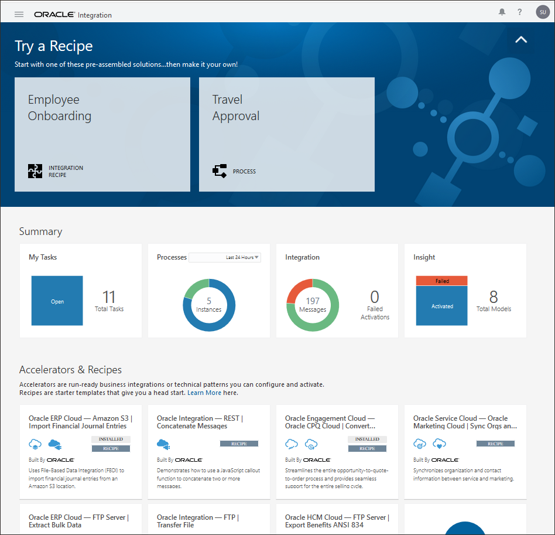
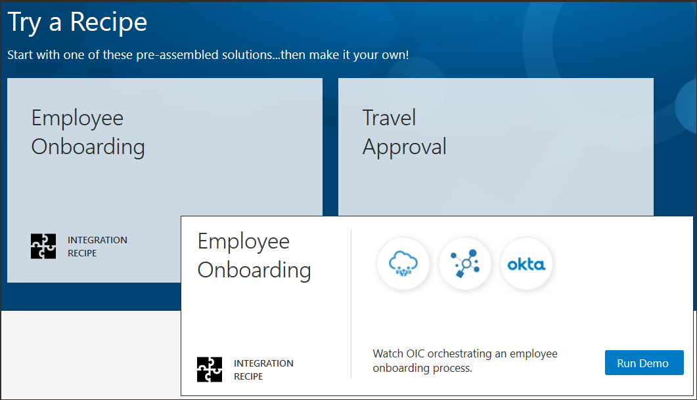
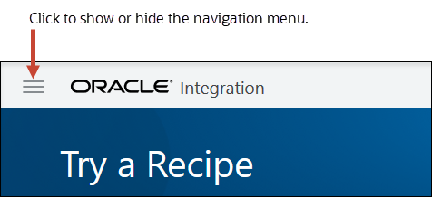
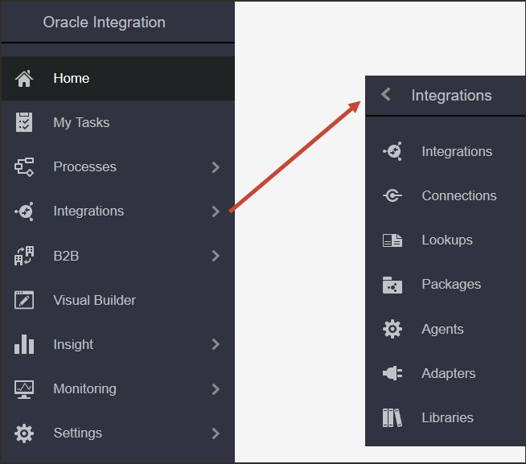

# Oracle Integration Layout and Navigation

## Introduction

In this section we will cover the basic layout of the Oracle Integration product, the navigation scheme, and some common icon terminology we will use throughout the rest of the workshop.

## Home page

When you sign in to Oracle Integration, the Home page opens. From here, you can navigate
to the product features you want, view a mini dashboard of relevant metrics and status, and
link directly to your current tasks, applications, and work in progress.

### Try an Integration Recipe or a Process QuickStart

The Try a Recipe banner at the top of the Home page showcases an integration recipe for employee onboarding and a QuickStart App for a travel approval process.

These two prebuilt solutions are from the extensive collection of recipes, accelerators, QuickStart Apps, and samples included in Oracle Integration. You can use any available prebuilt solution to get a head start in building integrations or process applications instead of creating them from scratch.

### Get Familiar with the Home Page

Take a moment to get familiar with all you can do on the Home page.

| Home Page Element &nbsp; &nbsp; &nbsp; | Description |
| ----------------- | ----------- |
| **Try a Recipe** | Showcases an integration recipe for employee onboarding and a QuickStart App for a travel approval process. These two prebuilt solutions are from the extensive collection of recipes, accelerators, QuickStart Apps, and samples included in Oracle Integration. You can use any available prebuilt solution to get a head start in building integrations or process applications instead of creating them from scratch.    **Tip**: To hide the banner and free up space on the Home page, click the Up Arrow Up Arrow icon icon. |
| **Summary** | Gives you a snapshot of key metrics for your tasks, processes, integrations, and Insight models. For a break down of the total numbers, position the cursor over a color. For quick access to more details, click an individual card. |
| **Accelerators & Recipes** | Lists some of the accelerators and recipes available in Oracle Integration. Accelerators and recipes jump-start your integration development and provide end-to-end connections for critical business problems. To browse the entire collection, click Search All. |
| **Recent** | Provides direct access to the integrations and process applications that you worked on recently. It's a quick and easy way to return to your work. |
| **My Tasks** | Displays the most recent process tasks assigned to you. |
| **Go to** | Jumps directly to the appropriate page and tools for developing processes, integrations, B2B integrations, visual applications, or Insight models. |
| **New Request** | Lists the process applications available to you. You can run the application and submit a request without having to navigate to the My Apps page. |
|    **Learn** | Provides access to more information about Oracle Integration, including what's new, videos, and online help.    You can also click the Help icon in the toolbar to access videos, tutorials, and online help at any time. |
|    **Announcements** | Displays announcements about important events or issues concerning this Oracle Integration instance. |
|    **Navigation** | Shows or hides the navigation pane and menu.    The Home page gives you quick access to what you do in Oracle Integration. However, it's not your only option. At any time, you can click the Navigation Menu icon in the top-left corner of the Home page to access all pages, tools, dashboards, and settings. |

## Navigation

Use the navigation pane to get access to all the pages, tools, dashboards, and settings in Oracle Integration.

When you start Oracle Integration, the navigation pane is hidden. To view the navigation pane, click the Navigation Menu icon in the top-left corner of the Home page.

The menu displayed in the navigation pane depends on your assigned role, your selection, and your location in Oracle Integration. The navigation pane may display the main menu or a sub-menu, such as the one for Integrations.

Take a moment to learn about the main menu. It gives you access to the Oracle Integration runtime environment, design-time environment, development tools, and administration settings.

| Click... &nbsp; &nbsp; &nbsp; &nbsp; &nbsp; &nbsp; | To... |
| ----------------------- | ----- |
|    **Home** | Access the launch pad and high-level dashboard for Oracle Integration, search for accelerators and recipes, and open recently worked on projects. |
|    **Tasks** | Launch the runtime environment for process tasks. Start process applications, work on tasks as a user, view dashboards, and perform runtime administration such as mapping process roles.   See [Quick Tour of the Tasks Page](https://docs.oracle.com/pls/topic/lookup?ctx=en/cloud/paas/integration-cloud/int-get-started&id=CPRCW-GUID-DFCE62B5-B164-426B-8803-C7CDFFBB365F) for more information. |
|    **Processes** | Launch the design-time environment for process applications. Create process applications from scratch or by using QuickStart Apps and samples. Model structured and dynamic processes in the process editor, and create web forms and decision models. Perform design-time administration such as playing, testing, and deploying applications.   See [Quick Tour of the Processes Page](https://docs.oracle.com/pls/topic/lookup?ctx=en/cloud/paas/integration-cloud/int-get-started&id=CPRCW-GUID-41E380C9-B3CD-4CAD-A6BD-65F98460C3DA) for more information. |
|    **Integrations** | Launch the design-time environment for integrations. Configure connections, and create and activate integrations. Work with lookups, packages, agents, and adapters.   See [Getting Started with Integrations](https://docs.oracle.com/pls/topic/lookup?ctx=en/cloud/paas/integration-cloud/int-get-started&id=ICSUG-GUID-1A01B559-8A46-4D9E-8313-E5400C3A0C9B) for more information. |
|    **B2B** | Exchange business documents between Oracle Integration and a trading partner securely and reliably.   See [Introduction to B2B for Oracle Integration](https://docs.oracle.com/pls/topic/lookup?ctx=en/cloud/paas/integration-cloud/int-get-started&id=ICBTB-GUID-11EFFD48-3E63-4C60-8771-DE789FF90909) for more information. |
|    **Visual Builder** | Create and publish web and mobile applications.   See [Getting Started with Oracle Visual Builder](https://docs.oracle.com/pls/topic/lookup?ctx=en/cloud/paas/integration-cloud/int-get-started&id=VBCDH-GUID-B5E3648B-46B3-4C90-8E47-39BBD8D61113) for more information. |
|    **Insight** | Model business processes and monitor business metrics in real-time using interactive dashboards to take timely actions.   See [Introduction to Integration Insight](https://docs.oracle.com/pls/topic/lookup?ctx=en/cloud/paas/integration-cloud/int-get-started&id=INTIZ-GUID-1AB84942-E46F-421C-988E-A698D544DCB5) for more information. |
|    **Monitoring** | Monitor integrations in the runtime environment. View the dashboard to see the performance of your integrations, track business identifiers associated with your integrations, monitor scheduled integration runs, or view and manage errors.   See [Viewing the Dashboard](https://docs.oracle.com/pls/topic/lookup?ctx=en/cloud/paas/integration-cloud/int-get-started&id=ICSUG-GUID-A18B7212-6246-40A1-A7BB-E495EE29A92A) for more information. |
|    **Settings** | Configure settings for error logs and manage security certificates. Specify other settings such as notification services and mapping recommendations.   See [Configure Settings for Error Logs](https://docs.oracle.com/pls/topic/lookup?ctx=en/cloud/paas/integration-cloud/int-get-started&id=INTSU-GUID-60C23C9D-D734-4CBA-8287-F78D2BCB2508) and [Upload an SSL Certificate](https://docs.oracle.com/pls/topic/lookup?ctx=en/cloud/paas/integration-cloud/int-get-started&id=ICSUG-GUID-9F6A7704-A8DE-484E-8D8A-06D51AD9D13C) for more information. |
